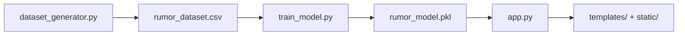

## About This Project

This project is a graph-theory based rumor detection demo. It models each cascade as a temporal propagation tree, extracts interpretable structural and timing features, and uses those features to classify the cascade as rumor-like or organic. The goal is explainability: the prediction should be traceable to graph measurements rather than a black-box embedding model.

## What The Code Actually Does

- Generates synthetic rumor and organic cascades locally with NetworkX.
- Assigns each edge a delay, cumulative timestamp, and temporal weight.
- Extracts 18 hand-crafted graph and diffusion features.
- Trains a RandomForestClassifier on the labeled dataset.
- Serves the model through a Flask app with `/`, `/about`, `/compare`, `/predict`, and `/generate-graph` routes.
- Renders the propagation tree in the browser with D3.js and supports zooming, dragging, and edge tooltips.

## Pipeline

The dataset generator builds 500 rumor graphs and 500 organic graphs by default. Training then loads `rumor_dataset.csv`, fits a RandomForest model, and stores the trained bundle in `rumor_model.pkl`. When the Flask app starts, it loads the saved bundle or trains it if the artifact is missing.

## Graph Generation

Rumor graphs are generated as star-like, hub-heavy, or branched trees with short delays. Organic graphs are generated as path-like, sparse, or lightly branched trees with longer delays. Every edge stores:

- `delay`: the propagation delay from parent to child
- `timestamp`: the cumulative arrival time of the child node
- `weight`: the temporal edge weight computed as `1 / ln(1 + delta_t)`

The source node is always node `0`. In the UI it is labeled `Source` and highlighted as the root of the cascade.

## Features Used By The Model

The classifier uses these 18 features:

1. nodes
2. edges
3. avg_degree
4. max_degree
5. density
6. diameter
7. radius
8. clustering
9. avg_shortest_path
10. degree_centrality_mean
11. degree_centrality_max
12. betweenness_mean
13. closeness_mean
14. centralization
15. avg_temporal_weight
16. diffusion_speed
17. branching_factor
18. leaf_ratio

The feature extractor also computes a human-readable graph center label for the dashboard, even though that value is not part of the model input.

## Web App

The Flask app serves three pages:

- Home dashboard: generates a new cascade, renders the graph, and shows the model prediction.
- About page: explains the graph-theory and temporal features used in the project.
- Compare page: shows a rumor example and an organic example side by side.

The dashboard graph is drawn with D3 force simulation and includes zoom controls plus drag interaction. Hovering an edge shows the delay, stored weight, and the weight formula. The compare page uses the same D3 rendering approach with separate zoom controls for each example graph.

## Key Files

| File | Purpose |
| --- | --- |
| `dataset_generator.py` | Builds synthetic rumor and organic propagation trees. |
| `feature_extractor.py` | Converts each graph into numerical features. |
| `train_model.py` | Trains the classifier and saves `rumor_model.pkl`. |
| `app.py` | Loads the model and serves the Flask routes and API endpoints. |
| `templates/` | HTML templates for the dashboard, about page, and comparison page. |
| `static/` | CSS and JavaScript for the interactive visualization. |
| `rumor_dataset.csv` | Generated training dataset. |

## Why This Approach

- It keeps the model interpretable because each prediction comes from explicit graph metrics.
- It fits a graph theory project better than a graph neural network because the reasoning is visible.
- It makes the rumor vs organic contrast easy to explain visually and mathematically.

## Run Order

1. Create and activate the virtual environment.
2. Install dependencies from `requirements.txt`.
3. Run `python dataset_generator.py` if you want to regenerate the dataset.
4. Run `python train_model.py` to train and save the model bundle.
5. Run `python app.py` to start the Flask server.

## Notes

- The project is a prototype and is intended for demonstration and study.
- The current implementation uses a RandomForest model, not a GNN.
- The browser UI is part of the codebase, so the documentation should describe both the math and the interface.
