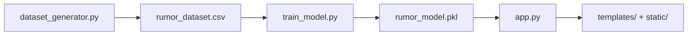

## About This Project

This project is a graph-theory based rumor detection demo. It represents each cascade as a temporal directed tree, extracts interpretable structural and timing features, and uses those features to classify the cascade as rumor-like or organic. The goal is explainability: every prediction should be traceable to graph measurements rather than a hidden embedding model.

## What The Project Does

- Generates synthetic rumor and organic cascades locally with NetworkX.
- Assigns each edge a delay, cumulative timestamp, and temporal weight.
- Extracts 18 hand-crafted graph and diffusion features.
- Trains a RandomForestClassifier on the labeled dataset.
- Serves the model through a Flask app with `/`, `/about`, `/compare`, `/predict`, and `/generate-graph` routes.
- Renders the propagation tree in the browser with D3.js and supports zooming, dragging, and edge tooltips.
- Shows graph-generation time in the dashboard UI.

## Graph-Theory Concepts Used

This project uses standard graph-theory ideas, but it applies them to propagation trees instead of abstract textbook examples.

### 1. Directed Graphs and Trees

Each cascade is built as a directed graph, and in practice it is a tree rooted at node `0`.

- **Concept**: A directed graph stores ordered edges, so the direction matters.
- **Implementation**: `dataset_generator.py` creates a `networkx.DiGraph` and adds edges from parent to child.
- **Why it matters**: Information flow always has a direction in a rumor cascade, from earlier nodes to later nodes.

### 2. Root Node and Propagation Order

Node `0` is the source of every generated graph.

- **Concept**: The root is the origin of the cascade.
- **Implementation**: Node `0` is always created first, and every other node is attached beneath it.
- **UI detail**: The dashboard labels node `0` as `Source`.

### 3. Edge Delays, Timestamps, and Temporal Weight

Every edge carries time-based metadata.

- **Concept**: Graphs can be extended with temporal attributes so that structure and time are both measured.
- **Implementation**: Each edge stores `delay`, `timestamp`, and `weight`.
- **Formula**: The temporal edge weight is computed as $1 / \ln(1 + \Delta t)$, where $\Delta t$ is the delay.
- **Why it matters**: Shorter delays produce larger weights, so fast propagation becomes more influential in the feature set.

### 4. Degree and Branching Structure

The project measures how wide and branchy a cascade is.

- **Concept**: Node degree counts how many neighbors a node has.
- **Implementation**: The feature extractor computes `nodes`, `edges`, `avg_degree`, `max_degree`, `branching_factor`, and `leaf_ratio`.
- **Why it matters**: Rumor graphs tend to spread through more centralized or burst-like branching, while organic graphs often spread more gradually.

### 5. Density and Connectivity

- **Concept**: Density measures how many edges exist compared with the maximum possible.
- **Implementation**: The feature extractor calculates graph density from the directed tree.
- **Why it matters**: Even though these graphs are trees, density still reflects how compact the structure is relative to its node count.

### 6. Shortest Paths, Diameter, and Radius

- **Concept**: Shortest paths measure minimum hop distance between nodes.
- **Implementation**: The feature extractor calculates `avg_shortest_path`, `diameter`, and `radius`.
- **Why it matters**: Rumor-like trees often have shorter, more centralized distances, while path-like organic graphs usually grow longer chains.

### 7. Graph Center

- **Concept**: The center of a graph is the set of nodes with minimum eccentricity.
- **Implementation**: The feature extractor computes a readable center label for the dashboard.
- **Why it matters**: The center gives an interpretable view of where the most central part of the propagation tree sits.

### 8. Centrality Measures

The model uses several classical centrality metrics.

- **Degree centrality**: captures how connected a node is relative to the graph size.
- **Betweenness centrality**: captures how often a node sits on shortest paths.
- **Closeness centrality**: captures how near a node is, on average, to all others.
- **Implementation**: The feature extractor aggregates each of these into mean and max summary features where needed.
- **Why it matters**: Rumor cascades often concentrate influence around a few important nodes.

### 9. Clustering and Centralization

- **Concept**: Clustering measures triangle-like local grouping; centralization measures how concentrated the network is around a small number of nodes.
- **Implementation**: These are computed directly from the generated tree structure.
- **Why it matters**: They help distinguish more star-like rumor trees from longer, more distributed organic trees.

## How The Concepts Are Implemented

The implementation is split across the project in a simple pipeline:

`dataset_generator.py` builds the synthetic cascades and labels them. `feature_extractor.py` converts each graph into the numerical feature vector used for training. `train_model.py` fits the RandomForest model and saves the bundle to `rumor_model.pkl`. `app.py` loads the model, serves the pages, and exposes the prediction and graph-generation endpoints. The browser renders the graph with D3.js, while the CSS controls the visual layout.

## Graph Generation

Rumor graphs are generated as star-like, hub-heavy, or branched trees with short delays. Organic graphs are generated as path-like, sparse, or lightly branched trees with longer delays. Every edge stores:

- `delay`: the propagation delay from parent to child
- `timestamp`: the cumulative arrival time of the child node
- `weight`: the temporal edge weight computed as $1 / \ln(1 + \Delta t)$

The source node is always node `0`. In the UI it is labeled `Source` and highlighted as the root of the cascade.

## Features Used By The Model

The classifier uses these 18 features:

1. nodes
2. edges
3. avg_degree
4. max_degree
5. density
6. diameter
7. radius
8. clustering
9. avg_shortest_path
10. degree_centrality_mean
11. degree_centrality_max
12. betweenness_mean
13. closeness_mean
14. centralization
15. avg_temporal_weight
16. diffusion_speed
17. branching_factor
18. leaf_ratio

The feature extractor also computes a human-readable graph center label for the dashboard, even though that value is not part of the model input.

## Web App

The Flask app serves three pages:

- Home dashboard: generates a new cascade, renders the graph, and shows the model prediction.
- About page: explains the graph-theory and temporal features used in the project.
- Compare page: shows a rumor example and an organic example side by side.

The dashboard graph is drawn with D3 force simulation and includes zoom controls plus drag interaction. Hovering an edge shows the delay, stored weight, and the weight formula. The compare page uses the same D3 rendering approach with separate zoom controls for each example graph.

## Key Files

| File | Purpose |
| --- | --- |
| `dataset_generator.py` | Builds synthetic rumor and organic propagation trees. |
| `feature_extractor.py` | Converts each graph into numerical features. |
| `train_model.py` | Trains the classifier and saves `rumor_model.pkl`. |
| `app.py` | Loads the model and serves the Flask routes and API endpoints. |
| `templates/` | HTML templates for the dashboard, about page, and comparison page. |
| `static/` | CSS and JavaScript for the interactive visualization. |
| `rumor_dataset.csv` | Generated training dataset. |

## Why This Approach

- It keeps the model interpretable because each prediction comes from explicit graph metrics.
- It fits a graph theory project better than a graph neural network because the reasoning is visible.
- It makes the rumor vs organic contrast easy to explain visually and mathematically.

## Run Order

1. Create and activate the virtual environment.
2. Install dependencies from `requirements.txt`.
3. Run `python dataset_generator.py` if you want to regenerate the dataset.
4. Run `python train_model.py` to train and save the model bundle.
5. Run `python app.py` to start the Flask server.

## Notes

- The project is a prototype and is intended for demonstration and study.
- The current implementation uses a RandomForest model, not a GNN.
- The browser UI is part of the codebase, so the documentation should describe both the math and the interface.
