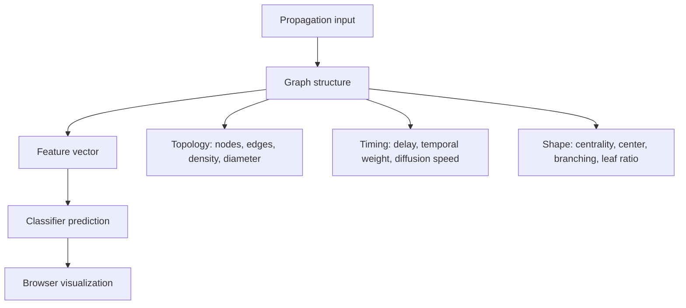

## About — Project flow and purpose

This project is a graph-theory based rumor detection demo. It studies how information spreads through a propagation tree, extracts structural and temporal features from that tree, and uses those features to predict whether a cascade looks rumor-like or organic.

## What this project does

- Builds synthetic propagation graphs from the dataset and feature pipeline.
- Extracts graph structure, centrality, and time-based features from each cascade.
- Trains a machine-learning classifier on those features.
- Serves predictions through a Flask app and displays the graph in the browser.
- Lets you compare rumor-like and organic propagation patterns side by side.

## How it is done

```mermaid
flowchart LR
    A[Raw dataset<br/>rumor_dataset.csv] --> B[Graph generation<br/>dataset_generator.py]
    B --> C[Feature extraction<br/>feature_extractor.py]
    C --> D[Model training<br/>train_model.py]
    D --> E[Saved model<br/>rumor_model.pkl]
    E --> F[Flask app<br/>app.py]
    F --> G[Web UI<br/>templates/ + static/]

    classDef dataStyle fill:#FFF3C4,stroke:#5A4B00,stroke-width:1px;
    classDef processStyle fill:#DCEEFF,stroke:#174A7E,stroke-width:1px;
    classDef modelStyle fill:#DFF7DF,stroke:#2E6B2E,stroke-width:1px;
    class A dataStyle;
    class B,C,D,F,G processStyle;
    class E modelStyle;
```

The workflow starts with a propagation graph, turns that graph into numeric features, trains a classifier, and then uses the trained model to make predictions from the browser interface or the API.

## What is being computed

### Graph-level features

- Number of nodes and edges.
- Average degree and maximum degree.
- Density, diameter, radius, and graph center.
- Average shortest path length and clustering behavior.

### Shape and influence features

- Degree centrality.
- Betweenness centrality.
- Closeness centrality.
- Degree centralization.
- Branching factor and leaf ratio.

### Temporal features

- Repost delay for each edge.
- Timestamp accumulation along the cascade.
- Temporal edge weights based on how quickly reposts happen.
- Diffusion speed derived from the average delay.

## What each file does

| File | Role |
| --- | --- |
| `dataset_generator.py` | Creates and prepares graph-shaped rumor and non-rumor samples. |
| `feature_extractor.py` | Converts each graph into a feature vector. |
| `train_model.py` | Trains the classifier and saves the final model bundle. |
| `app.py` | Loads the model and serves prediction endpoints plus the web pages. |
| `templates/` | Holds the HTML pages for the dashboard, about page, and comparison view. |
| `static/` | Contains CSS and JavaScript for the visual interface. |

## Main flow in simple terms

1. Generate or load propagation data.
2. Build a graph for each cascade.
3. Measure the graph with structural and temporal features.
4. Train a classifier on those features.
5. Send the model output to the Flask app and render it in the UI.

## Why this approach is used

- It keeps the model explainable because the prediction comes from explicit graph measurements.
- It makes the project easier to inspect than a black-box graph neural network.
- It works well for showing how rumor propagation differs from slower, more organic diffusion patterns.

## Visual summary

## Intended audience

Researchers, students, and engineers who want a compact, explainable demonstration of rumor detection on graph data. The focus is clarity, reproducibility, and visual inspection rather than large-scale production deployment.

## Notes

- The project is a prototype, so results should be validated carefully before using the ideas in real-world research.
- The current UI already includes an About page and a comparison view, so this document is meant to explain the full pipeline behind them.
