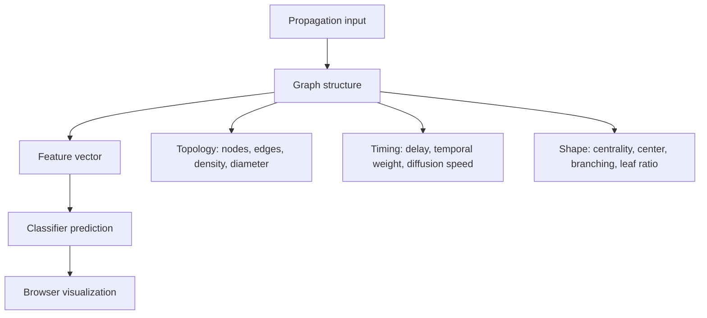

## About — Project flow and purpose

This project is a graph-theory based rumor detection demo. It studies how information spreads through a propagation tree, extracts structural and temporal features from that tree, and uses those features to predict whether a cascade looks rumor-like or organic. The goal is to make the process explainable, so the prediction can be traced back to measurable graph properties instead of a black-box representation.

## What this project does

- Builds synthetic propagation graphs from the dataset generation logic.
- Extracts graph structure, centrality, and time-based features from each cascade.
- Trains a machine-learning classifier on those features.
- Serves predictions through a Flask app and displays the graph in the browser.
- Lets you compare rumor-like and organic propagation patterns side by side.
- Uses an interactive visualization so the graph can be inspected, dragged, zoomed, and compared.

## How it is done

```mermaid
flowchart LR
    A[Raw dataset<br/>rumor_dataset.csv] --> B[Graph generation<br/>dataset_generator.py]
    B --> C[Feature extraction<br/>feature_extractor.py]
    C --> D[Model training<br/>train_model.py]
    D --> E[Saved model<br/>rumor_model.pkl]
    E --> F[Flask app<br/>app.py]
    F --> G[Web UI<br/>templates/ + static/]

    classDef dataStyle fill:#FFF3C4,stroke:#5A4B00,stroke-width:1px;
    classDef processStyle fill:#DCEEFF,stroke:#174A7E,stroke-width:1px;
    classDef modelStyle fill:#DFF7DF,stroke:#2E6B2E,stroke-width:1px;
    class A dataStyle;
    class B,C,D,F,G processStyle;
    class E modelStyle;
```

The workflow starts with a propagation graph, turns that graph into numeric features, trains a classifier, and then uses the trained model to make predictions from the browser interface or the API.

## How the graphs are visualized

The graphs are drawn in the browser with D3.js as SVG force-directed networks. The backend sends node and edge data, and the front-end turns that data into a live layout that settles into place automatically.

### Main graph view

- The main graph is rendered inside an SVG element on the dashboard.
- D3 force simulation positions the nodes using link, charge, center, and collision forces.
- The source node is highlighted to show where the propagation begins.
- Edge thickness reflects temporal weight, so faster reposts appear visually stronger.
- You can drag nodes manually and use zoom controls to inspect dense areas.
- Hovering an edge shows the delay, stored weight, and the weight formula used for that edge.

### Comparison view

- The compare page renders two separate SVG graphs side by side.
- One graph represents rumor-like diffusion and the other represents organic diffusion.
- Both use the same force-layout approach so the differences in shape are easier to compare.
- Each graph has its own zoom controls, which makes side-by-side inspection easier.
- The rumor example is usually more centralized and compact, while the organic example is longer and more chain-like.

### Visual cues used in the design

- Node size and color help identify the source node versus later nodes.
- Line width encodes temporal strength.
- Tooltips expose the math behind each edge.
- The compare page uses different accents for rumor and organic graphs so the two patterns are easy to distinguish.

## What is being computed

### Graph-level features

- Number of nodes and edges.
- Average degree and maximum degree.
- Density, diameter, radius, and graph center.
- Average shortest path length and clustering behavior.

### Shape and influence features

- Degree centrality.
- Betweenness centrality.
- Closeness centrality.
- Degree centralization.
- Branching factor and leaf ratio.

### Temporal features

- Repost delay for each edge.
- Timestamp accumulation along the cascade.
- Temporal edge weights based on how quickly reposts happen.
- Diffusion speed derived from the average delay.

## What is being analyzed

This project focuses on three things at once:

1. The topology of the graph, meaning how the nodes are connected.
2. The influence structure, meaning which nodes act like hubs or bridges.
3. The timing of the spread, meaning how fast the information moves through the network.

Those three views are combined into one feature vector so the classifier can distinguish different propagation styles.

## What each file does

| File | Role |
| --- | --- |
| `dataset_generator.py` | Creates and prepares graph-shaped rumor and non-rumor samples. |
| `feature_extractor.py` | Converts each graph into a feature vector. |
| `train_model.py` | Trains the classifier and saves the final model bundle. |
| `app.py` | Loads the model and serves prediction endpoints plus the web pages. |
| `templates/` | Holds the HTML pages for the dashboard, about page, and comparison view. |
| `static/` | Contains CSS and JavaScript for the visual interface. |

## Dependencies used

| Package | What it does | Where it is used |
| --- | --- | --- |
| `Flask` | Runs the web server, routes pages, and exposes prediction endpoints. | `app.py` |
| `NetworkX` | Builds and measures the propagation graphs. | `dataset_generator.py`, `feature_extractor.py` |
| `NumPy` | Handles numeric calculations such as averages and feature math. | `feature_extractor.py`, `app.py`, `train_model.py` |
| `Pandas` | Stores data in tables and prepares feature rows for training and inference. | `train_model.py`, `app.py`, `dataset_generator.py` |
| `scikit-learn` | Trains and evaluates the classifier. | `train_model.py`, `app.py` |

## Main flow in simple terms

1. Generate or load propagation data.
2. Build a graph for each cascade.
3. Measure the graph with structural and temporal features.
4. Train a classifier on those features.
5. Send the model output to the Flask app and render it in the UI.
6. Compare the rendered graph against known rumor-like and organic patterns.

## Why this approach is used

- It keeps the model explainable because the prediction comes from explicit graph measurements.
- It makes the project easier to inspect than a black-box graph neural network.
- It works well for showing how rumor propagation differs from slower, more organic diffusion patterns.
- It supports visual interpretation, which makes it useful for demonstrations, reports, and classroom-style explanations.

## Visual summary

## Intended audience

Researchers, students, and engineers who want a compact, explainable demonstration of rumor detection on graph data. The focus is clarity, reproducibility, and visual inspection rather than large-scale production deployment.

## Notes

- The project is a prototype, so results should be validated carefully before using the ideas in real-world research.
- The current UI already includes an About page and a comparison view, so this document is meant to explain the full pipeline behind them.
- If you want, I can also turn this into a more polished visual layout with callout boxes, badges, and a cleaner section design.
